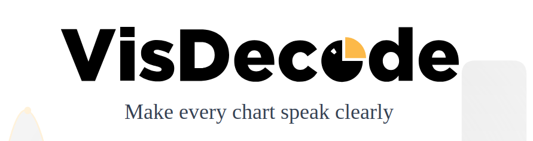

  

💡 **AI-Driven Interpretation & Enhancement of Scientific Plots**  
Helping researchers and data enthusiasts improve chart design and readability using **state-of-the-art visual language models**

---

---

## 🚀 What is VisDecode?

**VisDecode** is an open-source AI tool designed to automatically interpret scientific plots (like bar charts, scatterplots, and line charts) and provide actionable feedback for improving their design and communication. It leverages **visual language understanding** from image inputs to extract perceptual attributes — such as color, positioning, and visual structure — that influence how data is perceived.

The goal is to **bridge cutting-edge AI with best practices in visualization research** so that users can make more effective and insightful graphics.

---

## 🧠 Key Features

- 📊 **Automated plot interpretation**  
  Understands visual elements from rasterized chart images (e.g., SVG or PNG). 

- 🎯 **Design recommendations**  
  Outputs suggestions grounded in visualization research to improve clarity and impact. 

- 🤖 **AI-powered visual language models**  
  Uses pixel-to-text modeling for deeper semantic interpretation of visual features. 

- 🛠️ **Research-oriented and extensible**  
  Built for integration into scientific workflows and future research on visualization tooling.

---

## 📦 How It Works

1. **Upload or input a chart image**  
   Provide a standard scientific plot as an image.

2. **AI Vision Analysis**  
   VisDecode processes the visual content to extract attributes like layout, colors, scales, and elements.

3. **Design Feedback**  
   Suggestions and improvements are generated based on visualization best practices.

4. **Iterate & Improve**  
   Apply suggestions to improve chart clarity and interpretability.

> _Note: Technical details and API access may be available via the official repository._ 

---

## 📚 Research & Impact

VisDecode has been discussed and developed as part of broader scientific research initiatives aimed at creating AI tools that support enhanced scientific communication and practice. Grants and collaborations have supported its advancement, including funded projects focused on **AI-enabled research tools**. 

---

## 🧪 Getting Started

👉 **Visit the official website:**  
🔗 https://visdecode.ai/

---

## 📝 Citation

If you use VisDecode in your work, please cite the associated research and web resources.

---

